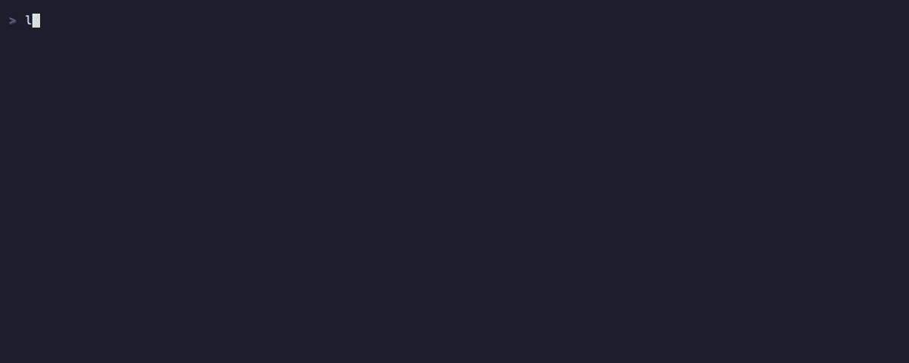

# lazystash

[](https://github.com/tanishq-khandelwal/lazystash/actions/workflows/ci.yml)
[](https://crates.io/crates/lazystash)
[](https://www.npmjs.com/package/lazystash)
[](LICENSE)

Browse, preview, and pop `git stash` entries in a terminal UI. One static binary, no fzf, no libgit2 — just `git` on your PATH.

Left pane: your stashes, always visible. Right pane drills down with you: a stash's live colorized diff, then its file tree (with +/- line counts), then a single file's diff — pop once you've found the one you wanted.



## Install

```sh
cargo install lazystash     # Rust toolchain
npm install -g lazystash    # downloads the prebuilt binary for your platform
```

Or download a prebuilt archive from [Releases](https://github.com/tanishq-khandelwal/lazystash/releases) and put `lazystash` on your PATH:

```sh
tar xzf lazystash-aarch64-apple-darwin.tar.gz
mv lazystash /usr/local/bin/
```

Prebuilt targets: macOS (Intel + Apple Silicon), Linux (x86_64 + arm64, static musl), Windows (x86_64). Each archive ships a `.sha256` alongside it.

The npm package contains no binary — it's a ~2kB wrapper whose postinstall downloads the release archive for your platform and verifies it against the published checksum before unpacking. So it needs network access to GitHub at install time, and `--ignore-scripts` will skip it (run `node node_modules/lazystash/install.js` yourself in that case).

## Usage

```sh
lazystash
```

| Key | Action |
| --- | --- |
| `j` / `k`, `↑` / `↓` | move selection — scrolls instead while viewing a file's diff |
| `l` / `→` | drill in: stash → file tree → file diff |
| `h` / `←`, `Esc` | back out a level |
| `Ctrl-d` / `Ctrl-u`, `PgDn` / `PgUp` | scroll |
| `Enter` | pop the selected stash (asks `y`/`n` first) |
| `p` | in the file tree or a file's diff: pop *just that file*, leaving the rest stashed |
| `q`, `Ctrl-c` | quit |

Mouse: wheel scrolls whichever pane it's over (stash list or diff/tree); clicking a file in the tree opens its diff. Support varies by terminal — the keyboard bindings above always work.

`--help` and `--version` print and exit without starting the UI. With no stashes it prints `No stashes.` and exits 0; outside a git repo it prints git's error and exits 1.

Pop is the only action that mutates anything, and it always confirms first. Conflict output from `git stash pop` is printed after the UI closes, so you can read it.

Requires `git` on your PATH; it is the only runtime dependency.

## Development

```sh
cargo test                                # unit + repo-backed integration tests
cargo clippy --all-targets -- -D warnings
cargo fmt --all
cargo run                                 # run against the current repo's stashes
```

Layout: `git.rs` (all `git` shell-outs + parsing), `app.rs` (state + transitions), `ui.rs` (rendering), `event.rs` (keys → state), `main.rs` (args, terminal setup/teardown).

The test suite creates a real scratch repo in your temp dir, makes two stashes, and exercises the git layer and the state machine against it — including an actual `pop`. Repo-backed tests all live in a single `#[test]` because they `set_current_dir`, which is process-global.

CI runs fmt, clippy, tests, and a release build on Linux, macOS, and Windows for every pull request.

Pull requests target `develop`, which is the default branch. See [CONTRIBUTING.md](CONTRIBUTING.md).

## Not included (deliberately)

Syntax highlighting inside diffs, `apply`/`drop`/`branch` actions, creating stashes, fuzzy filtering, mouse support. `pop` covers the actual use case; the rest is weight.

## License

GPL-3.0-or-later. See [LICENSE](LICENSE).
